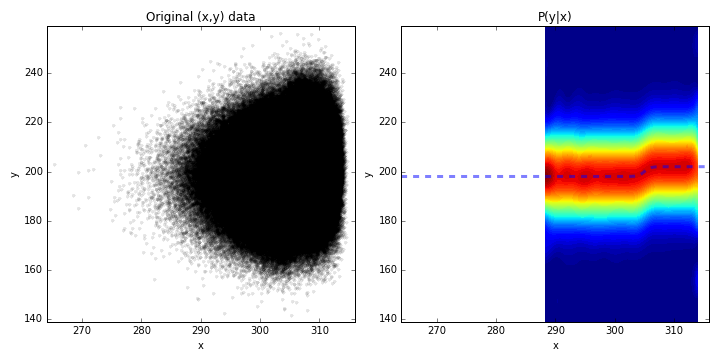

# fastKDE #

## Software Overview ##

Calculates a self-consistent probability density estimate of arbitrarily
dimensioned data. By default, this imlementation uses a multidimensional
version of the nuFFT-based Empirical Characteristic Function calculation
described by O'Brien et al. (2014; Computational Statistics and Data Analysis,
doi:10.1016/j.csda.2014.06.002), which improves the speed of the
self-consistent density esimate described by Bernacchia and Pigolotti (2011; J.
Royal Statistical Society C, doi:10.1111/j.1467-9868.2011.00772.x)

Example usage:

###For a standard PDF

```
#!python
 
import numpy as np
import fastKDE
import pylab as P

#Generate two random variables dataset (representing 100000 pairs of datapoints)
N = 2e5
var1 = 50*np.random.normal(size=N) + 0.1
var2 = 0.01*np.random.normal(size=N) - 300
  
#Do the self-consistent density estimate
myPDF,axes = fastKDE.pdf(var1,var2)

#Extract the axes from the axis list
v1,v2 = axes

#Plot contours of the PDF should be a set of concentric ellipsoids centered on
#(0.1, -300) Comparitively, the y axis range should be tiny and the x axis range
#should be large
P.contour(v1,v2,myPDF)
P.show()

```

###For a conditional PDF

The following code generates samples from a non-trivial joint distribution
```python
from numpy import *

#***************************
# Generate random samples
#***************************
# Stochastically sample from the function underlyingFunction() (a sigmoid):
# sample the absicissa values from a gamma distribution
# relate the ordinate values to the sample absicissa values and add
# noise from a normal distribution

#Set the number of samples
numSamples = int(1e6)

#Define a sigmoid function
def underlyingFunction(x,x0=305,y0=200,yrange=4):
     return (yrange/2)*tanh(x-x0) + y0

xp1,xp2,xmid = 5,2,305  #Set gamma distribution parameters
yp1,yp2 = 0,12          #Set normal distribution parameters (mean and std)

#Generate random samples of X from the gamma distribution
x = -(random.gamma(xp1,xp2,int(numSamples))-xp1*xp2) + xmid
#Generate random samples of y from x and add normally distributed noise
y = underlyingFunction(x) + random.normal(loc=yp1,scale=yp2,size=numSamples)
```

**Now that we have the x,y samples, the following code calcuates the conditional**
```python
#***************************
# Calculate the conditional
#***************************
pOfYGivenX,axes = fastKDE.conditional(y,x)
```

The following plot shows the results:
```python
#***************************
# Plot the conditional
#***************************
fig,axs = PP.subplots(1,2,figsize=(10,5))

#Plot a scatter plot of the incoming data
axs[0].plot(x,y,'k.',alpha=0.1)
axs[0].set_title('Original (x,y) data')

#Set axis labels
for i in (0,1):
    axs[i].set_xlabel('x')
    axs[i].set_ylabel('y')

#Draw a contour plot of the conditional
axs[1].contourf(axes[0],axes[1],pOfYGivenX,64)
#Overplot the original underlying relationship
axs[1].plot(axes[0],underlyingFunction(axes[0]),linewidth=3,linestyle='--',alpha=0.5)
axs[1].set_title('P(y|x)')

#Set axis limits to be the same
xlim = [amin(axes[0]),amax(axes[0])]
ylim = [amin(axes[1]),amax(axes[1])]
axs[1].set_xlim(xlim)
axs[1].set_ylim(ylim)
axs[0].set_xlim(xlim)
axs[0].set_ylim(ylim)

fig.tight_layout()

PP.savefig('conditional_demo.png')
PP.show()
```


## How do I get set up? ##

A standard python build:
```python setup.py install```

### Download the source ###

Please contact Travis A. O'Brien <TAOBrien@lbl.gov> to obtain the latest version of the source.

### Install pre-requisites ###
This code requires the following software:
  
  * Python >= 2.7.3
  * Numpy  >= 1.7
  * scipy
  * cython

## Copyright Information ##
```
LAWRENCE BERKELEY NATIONAL LABORATORY
RESEARCH & DEVELOPMENT, NON-COMMERCIAL USE ONLY, LICENSE
 
Copyright (c) 2015, The Regents of the University of California, through
Lawrence Berkeley National Laboratory (subject to receipt of any required
approvals from the U.S. Dept. of Energy).  All rights reserved.
 
Redistribution and use in source and binary forms, with or without
modification, are permitted provided that the following conditions are met:
 
(1) Redistributions of source code must retain the above copyright notice,
this list of conditions and the following disclaimer.
 
(2) Redistributions in binary form must reproduce the above copyright
notice, this list of conditions and the following disclaimer in the
documentation and/or other materials provided with the distribution.
 
(3) Neither the name of the University of California, Lawrence Berkeley
National Laboratory, U.S. Dept. of Energy nor the names of its contributors
may be used to endorse or promote products derived from this software
without specific prior written permission.
 
(4) Use of the software, in source or binary form is FOR RESEARCH
& DEVELOPMENT, NON-COMMERCIAL USE, PURPOSES ONLY. All commercial use rights
for the software are hereby reserved. A separate commercial use license is
available from Lawrence Berkeley National Laboratory.

(5) In the event you create any bug fixes, patches, upgrades, updates,
modifications, derivative works or enhancements to the source code or
binary code of the software ("Enhancements") you hereby grant The Regents of
the University of California and the U.S. Government a paid-up,
non-exclusive, irrevocable, worldwide license in the Enhancements to
reproduce, prepare derivative works, distribute copies to the public,
perform publicly and display publicly, and to permit others to do so.  THIS
SOFTWARE IS PROVIDED BY THE COPYRIGHT HOLDERS AND CONTRIBUTORS "AS IS" AND
ANY EXPRESS OR IMPLIED WARRANTIES, INCLUDING, BUT NOT LIMITED TO, THE
IMPLIED WARRANTIES OF MERCHANTABILITY AND FITNESS FOR A PARTICULAR PURPOSE
ARE DISCLAIMED. IN NO EVENT SHALL THE COPYRIGHT OWNER OR CONTRIBUTORS BE
LIABLE FOR ANY DIRECT, INDIRECT, INCIDENTAL, SPECIAL, EXEMPLARY, OR
CONSEQUENTIAL DAMAGES (INCLUDING, BUT NOT LIMITED TO, PROCUREMENT OF
SUBSTITUTE GOODS OR SERVICES; LOSS OF USE, DATA, OR PROFITS; OR BUSINESS
INTERRUPTION) HOWEVER CAUSED AND ON ANY THEORY OF LIABILITY, WHETHER IN
CONTRACT, STRICT LIABILITY, OR TORT (INCLUDING NEGLIGENCE OR OTHERWISE)
ARISING IN ANY WAY OUT OF THE USE OF THIS SOFTWARE, EVEN IF ADVISED OF THE
POSSIBILITY OF SUCH DAMAGE.  *** Copyright Notice *** FastKDE v1.0,
Copyright (c) 2015, The Regents of the University of California, through
Lawrence Berkeley National Laboratory (subject to receipt of any required
approvals from the U.S. Dept. of Energy).  All rights reserved.
If you have questions about your rights to use or distribute this software,
please contact Berkeley Lab's Innovation & Partnerships Office at
IPO@lbl.gov.
NOTICE.  This software was developed under funding from the U.S. Department of Energy.  As such,
the U.S. Government has been granted for itself and others acting on its
behalf a paid-up, nonexclusive, irrevocable, worldwide license in the
Software to reproduce, prepare derivative works, and perform publicly and
display publicly.  Beginning five (5) years after the date permission to
assert copyright is obtained from the U.S. Department of Energy, and
subject to any subsequent five (5) year renewals, the U.S. Government is
granted for itself and others acting on its behalf a paid-up, nonexclusive,
irrevocable, worldwide license in the Software to reproduce, prepare
derivative works, distribute copies to the public, perform publicly and
display publicly, and to permit others to do so.
****************************
```